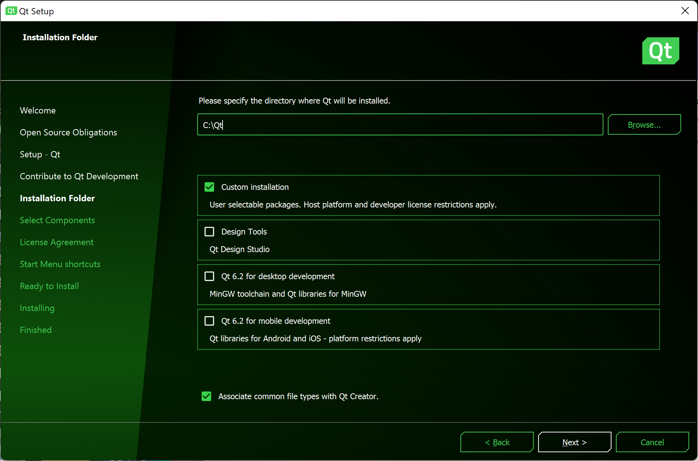
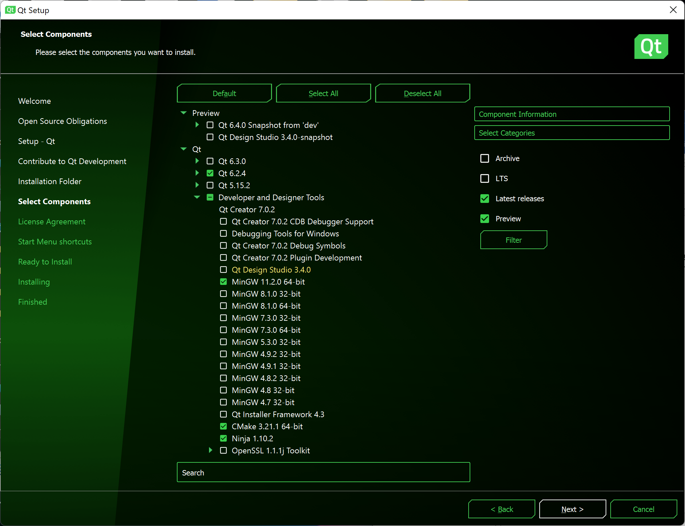

# Lab 1: Setup


## 0. Intro

The purpose of this lab is twofold: to help you get set up with working on CS123 projects locally, and to help you learn the basics of C++ -- The programming language that we will be using for the labs and the assignments.

In the rest of this 1-2h lab, you will:

1. Install Qt 6 locally on your computer, and
2. Build and run a starter Qt program, and
3. ??placeholder for C++ tutorial

**Note:** Overall Qt 6 and the C++ compiler will suck up ??GB of space, approximately. Additional images or scene files can also take up a fair bit of space. Be sure you have room.

##
##
## Installing Qt 6

## **Windows**

1. Install Qt (takes about ?? mins)

    a. [https://www.qt.io/download-qt-installer](https://www.qt.io/download-qt-installer)

    b. Open when done downloading
2. Follow instructions on the installer to create a new Qt account if you do not have one
3. When selecting components:

    a. Choose “Custom Installation”


    b. Under “Qt”, you’ll need Qt 6.2.4, and select the items as shown in the screenshot for the “Developer and Designer Tools” section. MinGW is what provides the GCC compiler you'll need to compile your C++ code.

4. Continue and finish the installation process.
5. We'll provide an example on how to open, configure and run a Qt project later on in this guide.

## Placeholders

## Hello World
A simple C++ program that does nothing is provided below:

```cpp
// A C++ program always starts from the main() function
// main() returns an integer indicating the execution state of the program
auto main()->int {
    // you may leave the function body of main() empty if it does nothing
    // the compiler automatically inserts "return 0;" for you
    // indicating the execution is successful
}
```

In a similar way that Python uses `import`s, C++ uses `#include`s. The imported functionalities are normally grouped under a namespace, which is denoted with the double colon `::` symbol. We'll use the C++ Standard Library namespace, also known as _std_, for our Hello World program

The **input/output library** (`iostream` library) is part of the C++ standard library that deals with basic input and output. We'll use the functionality in this library to get input from the keyboard and output data to the console. The _io_ part of _iostream_ stands for _input/output_.

- Available any time via `#include <iostream>`
- `std::cout` is how you will print to the command line
  - i.e. the output window in QtCreator, your IDE for this course :)
- `<<` inserts characters into the current output stream
- Works like string concatenation where the stream is the output string
- `std::endl` ends the line and inserts a newline character
- `std::cin` and `std::cerr` also exist
  - `std::cin` reads from stdin (terminal input)
  - `std::cerr` prints to stderr (terminal error messages)

#### ***Task 1:***

We are ready to write something on the screen!

- Write "Hello World!" in a `std::cout << "" << std::endl;` call in the `main` function.

At this point when you run your program you should see "Hello World!"

Now we can get into the more fun stuff!

## Primitive Types, Variables and Functions

Like many other programming languages, C++ comes with several primitive types including:

- integer-like types (integers, booleans, characters)
- floating point types
- arrays
- functions and lambdas
- pointers and references

Some of these you might already know from languages you learned before, some, such as pointers and references, are C++ concepts which we'll expand in the following sections. It is also worth noting that strings are not a primitive type in C++, string literals are simply character arrays. However, the standard library does provide the `std::string` type which allows us to perform common string operations.

C++ is a _typed_ language, meaning that we either have to declare the type when creating a variable:

```cpp
int x = 42;
double y = 3.14;
```

or use `auto` to tell the compiler to deduce the type for us from the initialization. This could be useful if the type name is very long or if we know roughly about what something is, but we're not sure about its exact type.

```cpp
auto z = 2.71; // type of z deduced as double

// I'm not exactly sure about the type of a string literal
// but I can ask the compiler to deduce it for me using auto
auto w = "random string abcd";
```

The same rules also apply to functions, the basic form of a function requires us to declare its return type, and the type for each parameter.

```cpp
auto PlusOne(int x)->int {
    return x + 1;
}
```

The return type after `->` can be omitted, in such case the compiler will deduce the return type from the return statement in the function body. You may create multiple functions with the same name and this allows you to do something called _overloading_, which you might have heard from languages like Java.

```cpp
auto PlusOne(int x)->int {
    return x + 1;
}

// overloading PlusOne
auto PlusOne(double x) { // return type will be deduced
    return x + 1; // return type deduced as double
}

auto a = PlusOne(123);  // calls PlusOne<int>
auto b = PlusOne(3.14); // calls PlusOne<double>
```

Now, we can restructure the example above a little bit better if we make `PlusOne` generic. This is easy to do in C++, we simply change the type of the corresponding parameters to `auto`, meaning they could be anything.
<details><summary>Hidden magic</summary>
    Your function would technically be a <a href="https://en.cppreference.com/w/cpp/language/function_template#Abbreviated_function_template">function template</a> if it contains at least one <em>auto</em> parameter.
</details>

```cpp
// generic PlusOne
auto PlusOne(auto x) {
    return x + 1;
}

auto a = PlusOne(123); // a == 124
auto b = PlusOne(3.14); // b == 4.14
```

There are another function-like entities in C++ called _lambdas_. We'll not explain it in detail since functional programming is outside the scope of this lab. However, we encourage you to play with it and ask questions either in TA hours or on Ed. You will likely need to use lambdas for certain extra credit features such as multithreading in your future assignments. Below shows you a toy example to get started with lambdas.

```cpp
auto Plus(auto Increment) {
    return [=](auto x) {
        return x + Increment;
    };
}

auto Apply(auto Operation, auto x) {
    return Operation(x);
}

auto x = Apply(Plus(20), 22); // x == 42
auto y = Apply(Plus(-1.1), 4.24); // y == 3.14
```

You can find more information about lambdas [here](https://en.cppreference.com/w/cpp/language/lambda).

#### ***Task 2:***

We can now write functions and use them to process different things!

- Write a function `TimesTwo` which takes an `int`, returns an `int`, and does what the function name suggests.
- Add `std::cout << TimesTwo(21) << std::endl;` to your `main` function.

You should see `42` when you run the program.

#### ***Task 3:***

Let's use what we learned and make `TimesTwo` more interesting!

- Change the signature of `TimesTwo` and make it generic.
- You might also need to change the definition in the function body of `TimesTwo` if you used multiplcation for the previous task. Note that multiplcation is not defined for `std::string`, but addition is, so how do you express "times 2" in the form of addition?
- Add the following print statements to your `main` function

```cpp
std::cout << TimesTwo(123) << std::endl;
std::cout << TimesTwo(3.14) << std::endl;
std::cout << TimesTwo(std::string{ "abc" }) << std::endl;
```

You should see `246`, `6.28` and `abcabc` when you run the program.

## Create Your Own Types